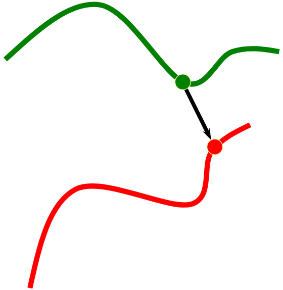

# Iterative Closest Point (ICP)

## Overview

What is the Iterative Closest Point algorithm? It is an algorithm that attempts to find the relative transformation between two point sets.

## Steps

1. Determine corresponding points between point sets
2. Compute rotation R and translation t
3. Apply R and t to the points to be registereed
4. Compute the error E(R, t)

## Determining the corresponding points

Before a transformation can be determined, points from each point set must be "matched" together, creaing corresponding points. This is done in multiple ways but I will be talking about closest point.

Closest point takes one point and finds the closest point in the other point set.

However, iterating through each point in a point set is extremely tedious (O(n^2) runtime) and we can make this so much more efficient by using a kd-tree. The kd-tree is a way to partition spaces for organizing points. Rather than iterating through every single point, we group points based on their spatial location and continually divide them until each leaf node is a point in the point set. By doing this, we can traverse the kd-tree to find which the closest point much faster.

## Computing R and t

Once we've established corresponding points between the point sets, we can now compute the rotation and translation that gets from one point set to the other.

## Apply R and t to the points to be registered

Pretty straightforward. Transform the points to be registered to the registered points.

## Compute the error

### Point-to-point metric

### Point-to-plane metric

## Important Considerations

- ICP is most effective when the points are "close enough".

## Sources
1. http://ais.informatik.uni-freiburg.de/teaching/ss12/robotics/slides/17-icp.pdf